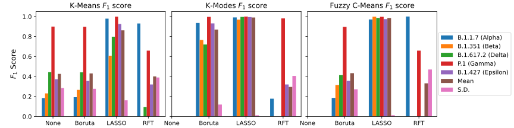
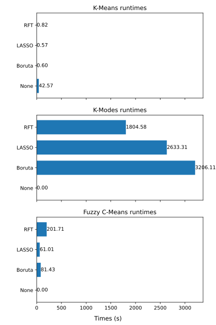

<div align="center">

# SARS-CoV-2 Variants Clustering

<div align="left">

<h2 id="first-section">What is this repo about?</h2>

This repo contains Python implementations for clustering spike protein sequences into recognized variants, aiding study on the spread and dynamics of rapidly emerging variants.

The spike sequences were retrieved from a publicly available dataset of SARS-CoV-2 spike sequences, which were then stored in a NumPy binary file (`filtered_protein_seq.npy`) for efficient data storage and read time.

To begin with, a $k$-mers-based approach is used to generate frequency vector representations of the spike sequences. Following that, feature selection process is applied on these feature vectors to mitigate the curse of dimensionality during clustering.

Finally, both hard and soft clustering methods are then used on these feature vectors, achieving high $F_1$ scores that allow for accurate, precise, yet efficient clustering of spike sequences by variant.

## Before using this repo...

First, clone this repo to your local machine. Then, create a new conda environment with its dependencies by executing the following syntax in terminal or console.

> Note: This repo is accelerated with Intel(R) Extension for Scikit-learn. So, make sure to clone this repo on Intel-powered local machine.

```
conda env create --file requirements.yml
```

After a new conda environment created, activate the environment by

```
conda activate sars-cov-2_clustering
```

Fuzzy C-Means clustering method is still not available in conda package manager. While in the activated `sars-cov-2_clustering` environment, install fuzzy-c-means package with `pip`.

```
pip install fuzzy-c-means
```

## How to use this repo?

First, as stated in [What is this repo about?](#first-section), a $k$-mers-based approach is performed by executing the following syntax on terminal/console.

> Ensure that your current working directory is set to the cloned repo.

```
python featureVec_Generator.py
```

After generating and saving feature vectors in a NumPy binary files, clustering can be performed using the methods in each respective folder.

Each respective clustering method folder includes the following:
- org/
  - Clustering without feature selection applied to the feature vectors.
  - Results in a longer runtime and lower $F_1$ score due to high dimensionality.
- Boruta/
  - Clustering after applying Boruta.
  - Boruta is a supervised method that is made around the random forest (RF) classification algorithm.
  - This works by creating shadow features so that the features do not compete among themselves, but rather they compete with randomized version of them.
    - It then extracts the importance of each feature (corresponding to the class label) and only keeps the features that are above specific threshold of importance.
- Lasso/
  - Clustering after applying **L**east **A**bsolute **S**hrinkage and **S**election **O**perator (LASSO) regression.
  - LASSO is a specific case of the penalized least squares regression with $L_1$ penalty function.
  - By combining the good qualities of ridge regression and subset selection, LASSO can improve both model interpretability, and prediction regression.
- RFT/
  - Clustering after applying a kernel-based method called Random Fourier Features (RFT).
  - RFT is an unsupervised approach, which maps the input data to a randomized low dimensional feature space (Euclidean inner product space) to get an approximate representation of data in lower dimensions $D$  from the original dimensions $d$.

To perform clustering on feature vectors, run:

```
python clusteringMethod_featureSelection.py
```

Here, replace `clusteringMethod` with `kmeans`, `kmodes`, or `fuzzy` and `featureSelection` with `org`, `Boruta`, `Lasso`, or `RFT`.

Next, create a contingency table by executing:

```
python new_cnt.py
```

Finally, calculate $F_1$ scores of the clustering method by running:

```
python Calculate_F1.py
```

## How about the performance?

The following are the results after running the repo on MacBook Pro 2020 with Intel(R) i7 Core Processor. There are 62657 observations with 9261 features (due to k-mers with k set equal to 3).

> Results for K-Modes and Fuzzy C-Means clustering on original feature vectors (without feature selection) are not available due to predicted runtimes exceeding a day.

### $F_1$ Scores


The plots show high $F_1$ scores across variants when clustering feature vectors processed with LASSO feature selection method. K-Modes and Fuzzy C-Means perform best, with K-Means also scoring high but exhibiting higher variance across Beta, Delta, and Epsilon variants.

### Runtimes


The runtime comparison shows K-Modes as the slowest clustering method. K-Means with LASSO feature selection method is the fastest but doesn't achieve the higher $F_1$ scores seen on Fuzzy C-Means with LASSO feature selection method.

## Don't Skip This!

You can experiment with different methods and even larger spike protein sequence datasets, maybe also includes newer variants like Omicron.
